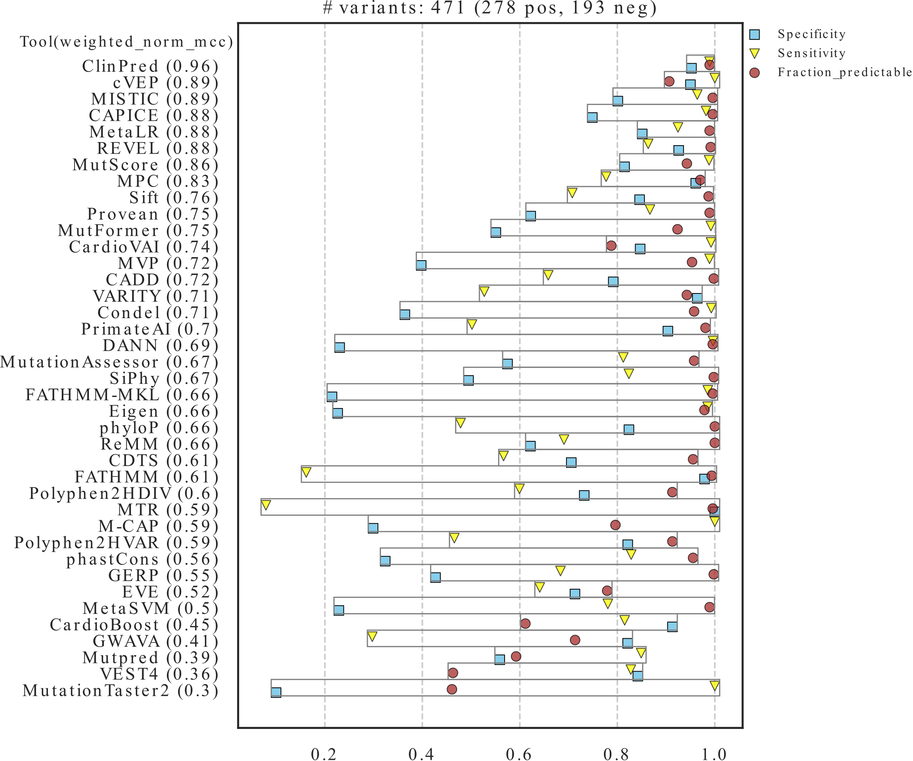
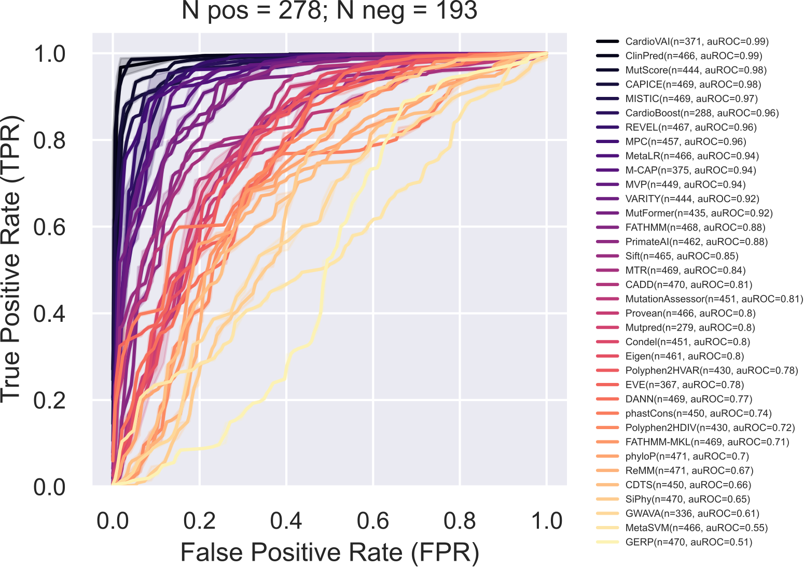
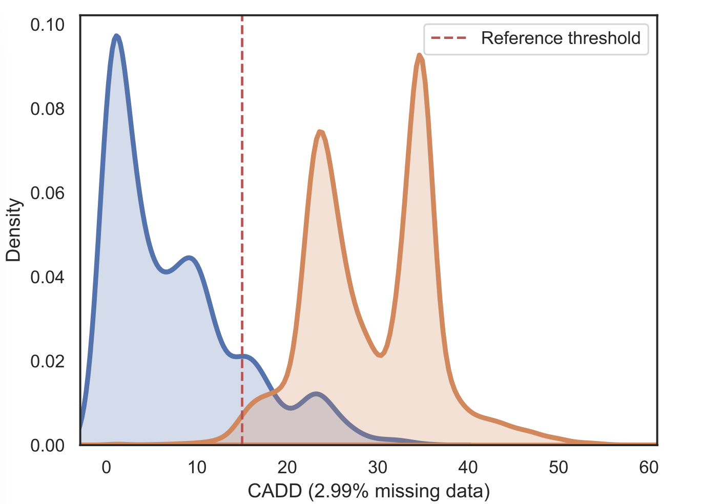
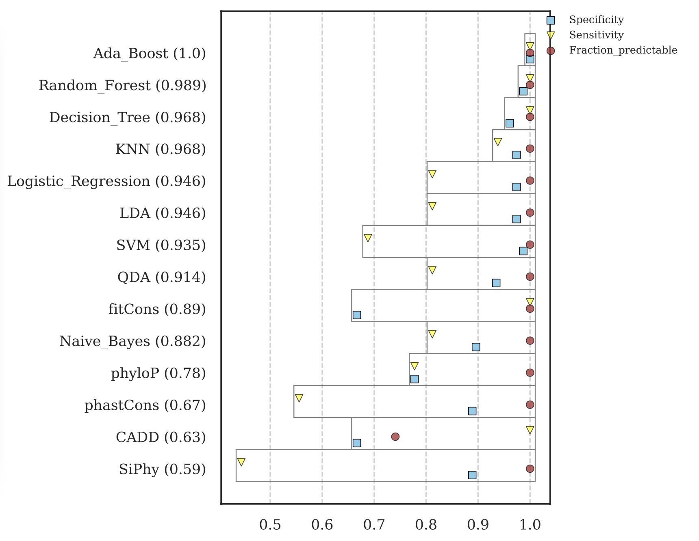
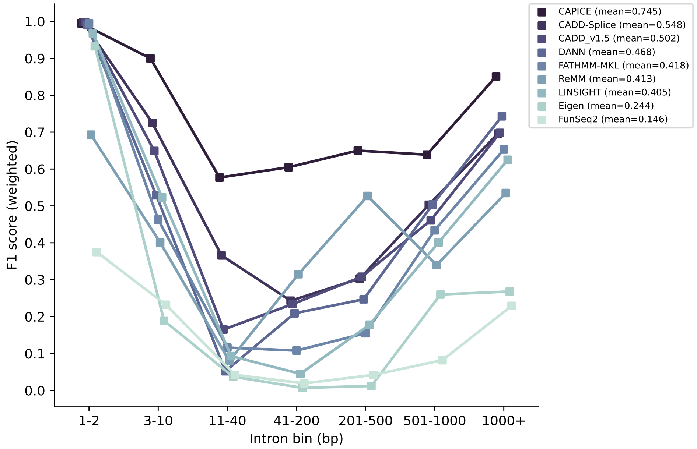
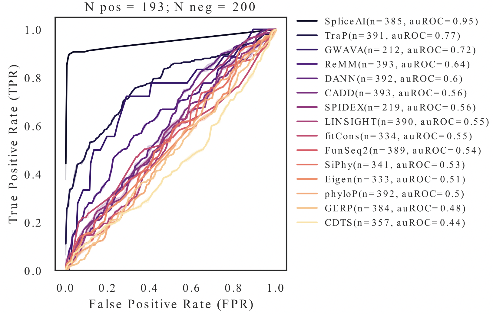
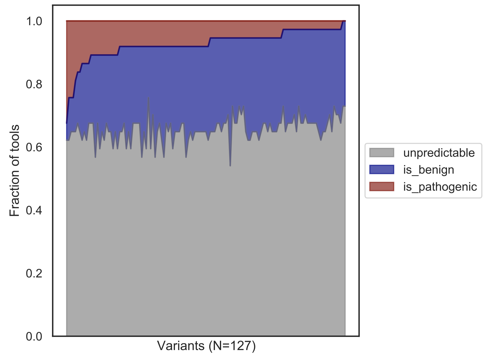
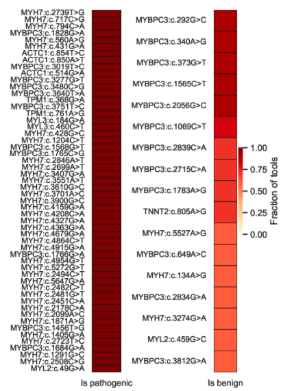
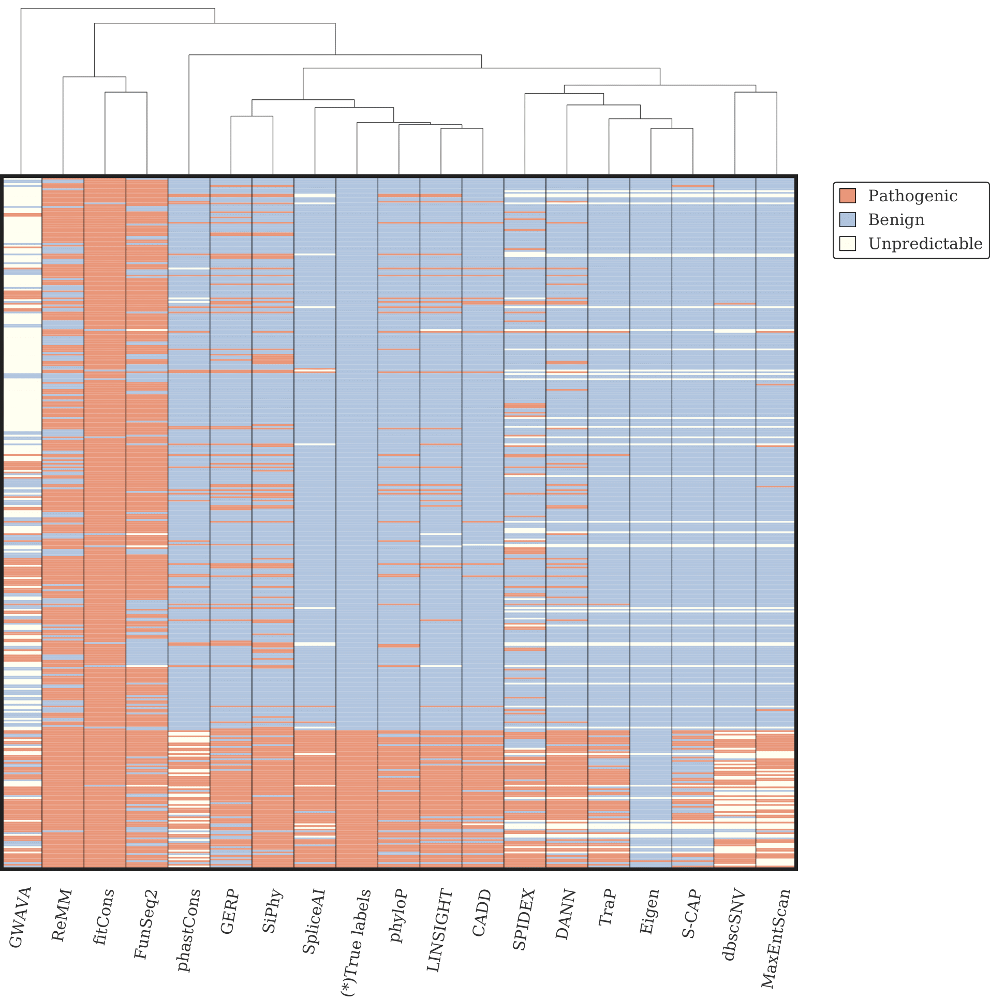

[](https://www.gnu.org/licenses/gpl-3.0)


## VETA - Variant prEdiction Tools evAluation
VETA is a tool that analyses the performance of several variant prediction methods at different levels. It can:

  * 1) Given labeled variants (e.g. benign and pathogenic), VETA benchmarks prediction tools and measures tools performance for different variant types and locations (e.g. SNVs in coding regions, SNVs in introns, insertions in 5'UTR, etc). If the dataset is large enough, VETA can inspect the reliability of reference thresholds.
  * 2) If labeled variants are from Clinvar, VETA allows additional analysis (e.g. disease-specific benchmark, filtering for review status desired).
  * 3) Evaluate prediction scores on a new VCF taking into account the reference thresholds described in literature. It will highlight top candidate variants that most of methods predict to be pathogenic.
  * 4) Apply machine learning to combine scores and improve predictions on a labeled dataset. It is useful to see which features (prediciton tools) are most important for the task, thus potentially informing which tools are relevant (and how many are sufficient) to predict variant effects in a clinical setting.
  
**What VETA is not:**
   * VCF annotator. For that you have [VEP](https://www.ensembl.org/info/docs/tools/vep/index.html), [vcfanno](https://github.com/brentp/vcfanno) or [bcftools annotate](http://samtools.github.io/bcftools/bcftools.html). 

# Table of Contents
1. [Installation](#installation)
2. [Input requirements](#requirements)
3. [Benchmark mode](#benchmark) 
    * [Using Clinvar dataset](#clinvar)
    * [Using a specific dataset](#user_provided)
    * [Reference threshold analysis](#threshold_analysis)
    * [Machine learning analysis](#metapredictions)
    * [Introns](#introns)
    
4. [Interrogate mode](#interrogate)
5. [Tool predictions](#scores_annotation)
    * [Tools supported by default](#default_tools)
    * [Manual config files](#manual_config)
    * [Custom functions](#processing_functions)
    
6. [Heatmaps](#heatmaps)
7. [Allele frequencies](#AF)


<a name="installation"></a>
## Intallation
VETA requires python >= 3.8 and can simply be installed with pip package installer:

~~~~
pip install veta
~~~~

If VCF file is large, VETA additionally requires `bcftools` to parallelize processing per chromosome.

If you run into problems, I recommend the creation of a conda environment, and further packaging of the project with `setuptools`:
~~~~
git clone https://github.com/PedroBarbosa/VETA.git
cd VETA
conda env create -f conda\_environment.yml
conda activate veta
pip install .
~~~~

Alternatively, there is a docker image available:
~~~~
docker pull pbarbosa/veta:latest
docker run pbarbosa/veta:latest veta --help
~~~~
When using the docker image, please make sure to map the input data onto the container by seting up a bindmount volume:
~~~~
docker run -v /local/dir/with/data/:/media pbarbosa/veta:latest veta benchmark [Other options..] --out_dir /media/veta_output /media/local/dir/with/data/ 
~~~~

<a name="requirements"></a>
## Input requirements

VETA has one main requirement: it only accepts VCF files annotated with Ensembl VEP. Particularly, it is required that VEP is run with the `--hgvs` flag. Some fields are extracted from VEP annotations, particularly the location of the variants (either from ```Consequence``` or ```HGVSc``` fields), so that VETA can employ different evaluations depending on the variant location (e.g. 5'UTR, coding, etc). Besides that, there are no special requirements. 

Internally, VETA takes care of the fact that some tools may be annotated within VEP field (ANN or CSQ), and others as independent INFO fields. As long as they are correctly set in the `--config` file, the user should not worry about that.

<a name="benchmark"></a>
## Running on reference datasets

Benchmark mode refers to the comparison of tools when reference labels are known, meaning we have a set of pathogenic and benign variants.
Multiple plots will be drawn and several tab-separated tables with performance statistics will be produced. Particularly, results will be generated both using reference thresholds (fixed thresholds) and variable thresholds (ROC curves):

<p float="left">
  
  
</p>

By default, analysis of all variant types is performed, but that can be restricted by selecting which variant types you are interested in:

```veta benchmark --types_of_variant snps```

VETA will analyse separately difference variant classes (e.g. missense, synonymous). To aggregate variant classes into more general concepts, please set `--aggregate_classes`. For example, setting this flag will aggregate missense, frameshifts synonymous as coding variants to be evaluated together.

To have a final tool ranking, veta uses `weighted_accuracy` (accuracy weighted by the fraction of predictable variants) to order the tools. It is very common to see tools with many missing data (e.g. protein predictors do not predict intronic variants), thus we incorporate this weighting scheme to take into account prediction capacity. Ranking metric can be changed. For example, if the dataset is umbalanced (few pathogenic, many benign), a better metric to use is the F1 score:

```veta benchmark --metric weighted_F1```

All metrics available can be inspected with `veta benchmark --help` in the `--metrics` argument.

Additionaly, VETA can restrict analysis to a subset of tools based on their scope. If the VCF is annotated with many prediction scores, it may be useful to analyse splicing variants with Splicing related predictors:

```veta benchmark --scopes_to_evaluate Splicing```

As an alternative, one can restrict the tools to analyse using a configuration file `--config`, which is further explained in the [Manual config](#manual-config-file) section.


It is easy to visually inspect whether a given tool behaves for the input dataset by looking at the class distribution plots automatically generated by VETA:

<p float="left">
  
<a name="clinvar"></a>

#### Clinvar

VETA has several internal functions to deal with clinvar data, namely providing a way to filter input variants at different review status levels. It exploits the VCF fields `CLNSIG` and `CLNREVSTAT` to subset input data into a stringency level desired by the user. By default, all evaluations are done in a subset of variants with a review status of > 1 stars with `pathogenic`, `likely_pathogenic`, `benign`, `likely_benign` interpretations. We call this filtering level `1s_l`, meaning we are using variants with a minimum review status of 1 stars, where we include `likely` assignments. If we want to use assertions without likely interpretations, we just set the ```--clinvar_stars``` argument to `1s`. Accordingly, to be more restrictive and use variants with > 3 stars, we can set the value to ```--clinvar_stars 3s_l```. Be aware that the number of evaluated variants (dataset size) can change dramatically, depending on the filtering status employed. 

It is possible to filter Clinvar variants to specific disease ontologies. VETA allows to filter fom OMIM (`--omim_ids`, MedGen `--medgen_ids` and MONDO (`--mondo_ids`). For example to select clinvar variants associated with Hypertrophic Caardiomyopathy in all ontologies one would set `--medgen_ids C3495498 C0949658 --omim_ids 192600 --mondo_ids 0005045 0024573`. This makes it very easy to perform disease-specific evaluations of Clinvar data.

Each time clinvar scores are processed, a ready-to-use dataframe is written in the same directory of the input file ```clinvar_file.vcf.gz.tsv```. If you repeat the analysis (e.g. using other arguments), this `tsv` file will be used instead. This avoids processing the whole vcf again, thus saving some time. 

<a name="user_provided"></a>
#### User specific dataset

It is possible to use VETA on user-defined labelled datasets. The only requirement is that VETA needs to know which variants correspond to each label. Hence, the input data should be a directory where two VCFs are present, one with pathogenic, and other with benign variants. This can be optimized in the future, but right now, it looks for patterns (\**pathogenic*\* or \**deleterious*\*) in file names to assign a file into a label. I recommend creating a new folder with just two VCF files, each file named like `pathogenic.vcf.gz` and `benign.vcf.gz`. Then, the same arguments explained above apply here (except to clinvar specific ones like `--clinvar_stars`, `--omim_ids`).

Be aware that predictions from tools that are just present in one of the files will be excluded from the analysis. The same will apply if the VCF field corresponding to a tool differs between the files (e.g. CADD scores are annotated with the field CADD_PHRED in the pathogenic file, and CADD_phred in the benign file).

<a name="threshold_analysis"></a>
#### Reference threshold analysis

The benchmark of prediciton tools is possible because a threshold for significance is pre-determined (in VETA reference thresholds for the supported tools are provided in the table displayed in the [default tools](#tools-supported-by-default) section, or provided by the user in the `--config` file). Usually, these decision thresholds are provided by the authors of each tool. If not, there are papers that specifically address that and infer the best decision threshold given the data at hands. We argue that strict reference thresholds may not be ideal, therefore we provide a means to evaluate how appropriate reference thresholds, given a minimum dataset size.

New thresholds for each tool are inferred based on different ratios of True Positives / False Positives the user desires using the [F beta formula](https://en.wikipedia.org/wiki/F-score). The outcome of this analysis may reveal different optimal thresholds for coding and intronic variants, as [TraP](http://trap-score.org/about) and [S-CAP](https://www.nature.com/articles/s41588-019-0348-4) already do.

Different values of Beta are used (0.5, 1, 1.5) to lend different importance on to precision/recall. For each Beta, the threshold value that maximizes the FBeta function is selected as the best. In practice, increasing this value will improve the number of true positives found at the cost of adding *Beta* false positives. This is clinically relevant as the user may want to be more or less stringent in his analysis, and fixed thresholds would limit the scope of the score interpretation.

Threshold analysis is activated using the corresponding flag in the benchmark mode:

```
veta benchmark clinvar_file.vcf.gz --do_threshold_analysis
```


<a name="metapredictions"></a>

In addition, `--bootstrap` argument can be activated when doing threshold analysis (`--do_threshold_analysis`). When set, VETA will employ a bootstrapping procedure for each tool, where at each iteration an adjusted threshold is derived for the given bootstrap sample (the sample statistic here is the adjusted threshold). To evaluate the stability of the results, we compute the 0.025 and 0.975 quantiles of the distribution of the bootstrap sample statistic and compare with the best threshold derived for the data sample (the real dataset). If the distribution of the bootstrap sample follows a normal/symmetrical distribution we could even use these quantiles to estimate confidence intervals, but this may not be possible for several tools (e.g. data sample is not representative for confident estimates; tool is barely better than random guessing; tool is not robust to the different types of errors we try to control). Users can allways inspect the bootstrap plots automatically generated by VETA to look at the bootstrap results with more detail.

#### Using machine learning to improve predictions 

Machine learning can be used to train metapredictors that use tool scores as features. The main objective is to inspect whether predictions can be improved by combining scores from multiple tools. We use [scikit-learn](https://scikit-learn.org/) to train several standard classifiers. They are evaluated using  StratifiedKFold cross validation to ensure both classes are equivalently represented at each fold. A gridsearch is performed to select the best set of hyperparameters and the best performant estimator is selected to evaluate performance on hold out test data. Performance of each classifier is compared against the top 5 individual tools (ranked by ``--metric``). Two equivalent performance plots are drawn: a) `*clf_along_best_tools.pdf` refers to the performance of the classifiers on test data along with the previously calculated metrics for the top5 tools on the whole dataset; b) `*clf_only_on_test_data` refers to a more fair comparison, where both classifiers and top tools metrics are calculated on the same test data.

Some acronyms that are used: KNN (K-Nearest Neighbours), QDA (Quadratic Discriminant Analysis), LDA (Linear Discriminant Analysis), SVM (Support Vector Machine).



Additionally, model interpretation techniques are employed to look at which tools were most important in the predictions, thus helping the user to select which features may be important and which ones are irrelevant to use. Feature Importances calculated from [Random Forests](https://scikit-learn.org/stable/auto_examples/ensemble/plot_forest_importances.html) (in the plot below), [Information Gain](https://scikit-learn.org/stable/modules/generated/sklearn.feature_selection.mutual_info_classif.html#sklearn.feature_selection.mutual_info_classif), [Cross Validation Recursive Feature Elimination](https://scikit-learn.org/stable/modules/generated/sklearn.feature_selection.RFECV.html#sklearn.feature_selection.RFECV) and [Decision Trees visualization with dtreeviz](https://github.com/parrt/dtreeviz) are applied. Additionally pearson correlation scores are produced to see which predictions correlate  the most.

<p float="left">
   
   
</p>


Machine learning analysis can be enabled by setting the proper flag:

```veta benchmark --do_machine_learning``` 

<a name="introns"></a>
### Analyzing intronic variants with more detail

VETA allows to inspect intronic variants by partitioning the dataset into different bins. Variants are assigned to each bin in respect to their distance to the closest splice junction. This information is obtained from the VEP annotations in the `HGVSc` field. Then, analysis is done on each bin and additional plots are drawn to identify how performance drops (or increases) as we go deeper in the introns. ROC curves and Precision-recall curves are also generated for all intronic variants and across each bin.

<p float="left">
  
  
</p>

This analysis can be enabled with the following flag:

```veta benchmark --do_intronic_analysis```

<a name="interrogate"></a>
## Running on the interrogate mode

This mode allows to inspect tools predictions on a single VCF file, where labels are unknown. It is useful to look at candidate variants that most tools predict to be functionally relevant. 

If you are sure the dataset is labeled (e.g. all variants in the VCF are pathogenic), you can set the `--labels Pathogenic` argument and additional performance metrics will be calculated, just like in benchmark mode.

In addition, If you have run before a benchmark analysis on a reference dataset, it is possible to automatically pick the best tools from that analysis and ensure that the ```veta interrogate``` run only cares about the best tools selected. For example, if you know from a ```veta benchmark``` run that deep intronic variants are well predicted by just two methods, you can set ```veta interrogate --best_tools tools_ranking_deep_intronic.csv (this file is produced by veta benchmark) --n_best_tools 2``` to ignore any other method. Tools scores histograms can be drawn for multiple tools by using another argument ```veta interrogate --plot_these_tools CADD GERP```.

<p float="left">
  
  
</p>

<a name="scores-annotation"></a>
## Prediction tools annotations in the VCF

VETA has native support for more than 50 prediction tools, with internal functions to process different prediction types. By default, it uses this [default config file](https://github.com/PedroBarbosa/VETA/blob/master/src/config/tools_config.txt) where it looks for specific VCF fields corresponding to specific tools. Please edit this file if your VCF has a different annotation name to some tools. Custom methods can also be added, but in this case additional information needs to be provided (namely the reference threshold, directionality and tool scope). In any case, if the default config file does not suite your needs, please set your custom defined file with the `--config` argument.

<a name="default_tools"></a>
#### Tools supported by default

Personally, I use a combination of VEP and [vcfanno](https://github.com/brentp/vcfanno) to annotate variants with pre-computed scores. While conservation scores are obtained from VEP website, many other were transferred from [dbNSFP](https://genomemedicine.biomedcentral.com/articles/10.1186/s13073-020-00803-9). For some tools, scores are directly derived from their own website (e.g. CADD, SpliceAI, S-CAP, TraP). In addition, some splicing related models are run with [kipoi](https://kipoi.org/). Please contact me if you need help on running any of the following methods.

---
List of tools available (more will be continuosly added)
---
| Category                        | Tool              | Threshold            | Incorporates_other_scores | Annotated_via |
|---------------------------------|-------------------|----------------------|---------------------------|---------------|
| Conservation scores             | GERP              | > 4.4                | No                        | vcfanno       |
|                                 | phyloP            | > 7.367              | No                        | vcfanno       |
|                                 | SiPhy             | > 12.7               | No                        | vcfanno       |
|                                 | phastCons         | > 0.99               | No                        | vcfanno       |
|                                 | CDTS              | < 10                 | No			                   | vcfanno       |
| Effects on protein function     | SIFT              | < 0.001              | No                        | VEP           |
|                                 | PolyPhen-2 HDIV   | > 0.978              | No                        | VEP           |
|                                 | PolyPhen-2 HVAR   | > 0.978              | No                        | VEP           |
|                                 | LRT               | < 0.01               | No                        | VEP           |
|                                 | Mutation Assessor | > 1.935              | No                        | VEP           |
|                                 | FATHMM            | < -4.14              | No                        | VEP           |
|                                 | PROVEAN           | < -2.5               | No                        | VEP           |
|                                 | MutationTaster2   | > 0.5                | No                        | VEP           |
|                                 | MutPred           | > 0.5                | Yes                       | VEP           |
|                                 | Condel            | > 0.468              | Yes                       | VEP           |
|                                 | CAROL             | > 0.98               | Yes                       | VEP           |
|                                 | M-CAP             | > 0.025              | Yes                       | VEP           |
|                                 | REVEL             | > 0.644              | Yes                       | VEP           |
|                                 | VEST4             | > 0.764              | Yes                       | VEP           |
|                                 | MetaSVM           | > 0.5                | Yes                       | VEP           |
|                                 | MetaLR            | > 0.5                | Yes                       | VEP           |
|                                 | MVP               | > 0.7                | Yes                       | vcfanno       |
|                                 | MTR               | < 0.5                | Yes                       | vcfanno       |
|                                 | MPC               | > 1.36               | Yes                       | vcfanno       |
|                                 | PrimateAI         | > 0.8                | Yes                       | vcfanno       |
|                                 | MISTIC            | > 0.5                | Yes                       | vcfanno       |
|                                 | VARITY            | > 0.75               | Yes                       | vcfanno       |
|                                 | ClinPred          | > 0.5                | Yes                       | vcfanno       |
|                                 | MutScore          | > 0.5                | Yes                       | vcfanno       |
|                                 | MutFormer         | > 0.5                | Yes                       | vcfanno       |
|                                 | EVE               | > 0.5                | No                        | vcfanno       |
| Disease specific predictors     | CardioBoost       | > 0.9                | Yes                       | vcfanno       |
|                                 | CardioVAI         | > 2                  | Yes                       | vcfanno       |
| Functional genomics annotations | FATHMM-MKL        | > 0.5                | Yes                       | vcfanno       |
|                                 | GWAVA             | > 0.5                | Yes                       | vcfanno       |
|                                 | Eigen             | > 1                  | Yes                       | vcfanno       |
|                                 | ReMM              | > 0.984              | Yes                       | vcfanno       |
|				                          | FunSeq2	          | > 1.5		             | Yes		                   | vcfanno       |
|				                          | CAPICE	          | > 0.02               | Yes		                   | vcfanno       |
| Fitness measurement             | CADD              | > 25.3               | Yes                       | vcfanno       |
|                                 | CADDSplice        | > 25.3               | Yes                       | vcfanno       |
|                                 | DANN              | > 0.9                | Yes                       | vcfanno       |
|                                 | fitCons           | > 0.4                | No                        | vcfanno       |
|                                 | LINSIGHT          | > 0.4                | Yes                       | vcfanno       |
| Splicing                        | MaxEntScan        | \|MaxEntScan_diff\|> 1 | No                      | kipoi         |
|                                 | dbscSNV           | > 0.6                | Yes                       | VEP           |
|                                 | SPIDEX            | \|dpsi_zscore\| > 2  | No                        | vcfanno       |
|                                 | TraP              | > 0.221 for coding, 0.174 for intronic | Yes     | vcfanno       |
|                                 | SpliceAI          | > 0.2                | No                        | vcfanno       |
| 		                            | HAL               | \|deltaPSI\| > 5	   | No			                   | kipoi         |
|                                 | S-CAP             | Different thresholds | Yes                       | vcfanno       |
|                                 | MMSplice          | \|deltaLogitPSI\| > 2| No                        | kipoi         |
|                                 | kipoiSplice4      | > 0.5                | Yes                       | kipoi         |
|                                 | kipoiSplice4_cons | > 0.5                | Yes                       | kipoi         |
|                                 | ConSpliceML       | > 0.5                | Yes                       | vcfanno       |
|                                 | SQUIRLS           | > 0.5                | Yes                       | vcfanno       |
|                                 | IntSplice2        | > 0.5                | Yes                       | vcfanno       |
<a name="manual_config"></a>
#### Manual config file

This config file maps the tool name to the corresponding annotation field in the VCF. It allows to add custom methods, as long as the field exists in the VCF.

Config file must be a tab-delimited file just like [this one](https://github.com/PedroBarbosa/VETA/blob/master/src/config/tools_config.txt).
Lines starting with '#' are skipped. For tools with native support within VETA (listed in the table above, where tool name must be matched), only the 2 columns are required. For custom methods, additional columns must be set. Column specifications are as following:

* 1st column - Tool name.
* 2nd column - VCF field for the tool.
* 3rd column - Tool directionality: whether the method detects relevant variants if the score if higher ('>') or lower ('<') than the reference threshold. 
* 4th column - Reference threshold used to distinguish functional vs benign variants.
* 5th column - Tool scope. Available options: 'Protein', 'Conservation', 'Splicing', 'Functional'.
* 6th column - Processing function. How the scores should be processed internally to select one single prediction per tool (for each variant).  Check section below for details.

Note: If multiple VCF fields refer to the same tool (e.g. dbscSNV), a comma must be set to use both in the 2nd column.

<a name="processing_functions"></a> 
#### Providing custom functions

6th column in the config file must refer to the processing function to apply for single prediction extraction. For now, valid functions are:

* `to_numeric` - If the VCF field refers to a single numeric value. The most common case.
* `top_max` - Fields that are annotated like `0.922&0.65&.&.&.`, selects the max value (in this case 0.922)
* `top_min` - Same as `top_max`, but selects the minimum value (tools such as Provean and FATHMM use this function)
* `top_min_abs` - Selects the minimum value after converting predictions into absolute values. `0.2&-0.65&0.5&.&.` selects 0.2.
* `categorical_to_numeric` - Converts categorical predictions (`Pathogenic`, `Likely_benign`) into floats to be evaluated using a reference threshold of `0.5`. For example, cVEP reports predictions this way. With such tools ROC curves or threshold analysis are not performed.
* `spliceai` - Selects top score from a spliceAI prediction in their original format `G|KCNA5|0.90|0.2|0.00|0.01|-23|32|-1|4`. Selects 0.9.
* `kipoi_like` - Selects top prediction from kipoi. For example, an MMSplice prediction can include negative dPSI changes. Thus, this function selects top absolute prediction. In a prediction like `-4.01,3.01,-0.1`, 4.01 is selected.
* `carol_like` - Process Condel and CAROL scores so that a numeric prediction is returned. This method is designed to process protein predictions made by some plugins in VEP, where an outcome category is added to the score. Example: `deleterious(1.000)` returns 1.000.
* `trap` - Process TraP scores (numeric fields) so that different reference thresholds based on the variant location are taken into account. 
* `scap` - Process S-CAP scores to select top prediction. Example: `1:5core:.:.:0.6556:0.3391:0.9711:0.0` returns 0.9711.
* `conspliceml`- Process ConspliceML predictions to numeric scores.

    
<a name="heatmaps"></a>
### Heatmaps

By default, VETA draws hierarchically-clustered heatmaps, which allows the user to evaluate how similar predictions from different tools are. If run on `benchmark` mode or `interrogate` with `--labels`, ground truth information will be included. This enables the user to easily visualize which tools clustered in proximity to the ground truth data. If the dataset is large (thousands of variants), this step may take long time. You can skip it with `--skip_heatmap` flag.




<a name="AF"></a>
### Note on allele frequency

If the input data has a field that somehow measures allele frequency, that information can be taken into account by VETA by additionally plotting allele frequencies between the variants belonging to each label (benchmark mode, figure below). For example, if gnomAD frequencies are represented in the VCF with the `gnomAD_AF` INFO field, one can set the `--allele_frequency gnomAD_AF` so that information is included in the analysis. More info in the help: ```veta benchmark --help```. If analysis is done with a Clinvar file and `AF*` are not present in the output, try to delete the `tsv` file a redo analysis from original VCF file.


If you find bugs or have suggestions, feel free to contact me to psbpedrobarbosa@gmail.com or by opening an issue.
